# 통합 ERD (Integrated Entity-Relationship Diagram)

## 서비스별 테이블 수

| 서비스 | 테이블 수 | 테이블 목록 |
|--------|-----------|-------------|
| **Auth** | 5 | positions, departments, users, company, refresh_tokens |
| **Master** | 8 | countries, incoterms, currencies, ports, payment_terms, clients, items, buyers |
| **Document** | 11 | proforma_invoices, pi_items, purchase_orders, po_items, commercial_invoices, packing_lists, production_orders, shipment_orders, approval_requests, collections, shipments |
| **Activity** | 8 | activities, contacts, email_logs, email_log_types, email_log_attachments, activity_packages, activity_package_viewers, activity_package_items |
| **합계** | **32** | |

## Cross-Service 참조 요약

| 참조 방향 | FK 컬럼 (실제 DDL 컬럼명) | 참조 대상 | 비고 |
|-----------|---------------------------|-----------|------|
| Master → Auth | clients.department_id | departments.department_id | 거래처 담당 부서 |
| Document → Auth | proforma_invoices.manager_id | users.user_id | PI 담당자 |
| Document → Auth | purchase_orders.manager_id | users.user_id | PO 담당자 |
| Document → Auth | production_orders.manager_id | users.user_id | 생산지시 담당자 |
| Document → Auth | shipment_orders.manager_id | users.user_id | 출하지시 담당자 |
| Document → Auth | approval_requests.approval_requester_id | users.user_id | 결재 요청자 |
| Document → Auth | approval_requests.approval_approver_id | users.user_id | 결재 승인자 |
| Document → Auth | collections.manager_id | users.user_id | 수금 담당자 |
| Document → Master | proforma_invoices.client_id | clients.client_id | PI 거래처 |
| Document → Master | proforma_invoices.currency_id | currencies.currency_id | PI 통화 |
| Document → Master | purchase_orders.client_id | clients.client_id | PO 거래처 |
| Document → Master | purchase_orders.currency_id | currencies.currency_id | PO 통화 |
| Document → Master | commercial_invoices.client_id | clients.client_id | CI 거래처 |
| Document → Master | commercial_invoices.currency_id | currencies.currency_id | CI 통화 |
| Document → Master | packing_lists.client_id | clients.client_id | PL 거래처 |
| Document → Master | production_orders.client_id | clients.client_id | 생산지시 거래처 |
| Document → Master | shipment_orders.client_id | clients.client_id | 출하지시 거래처 |
| Document → Master | collections.client_id | clients.client_id | 수금 거래처 |
| Document → Master | collections.currency_id | currencies.currency_id | 수금 통화 |
| Document → Master | shipments.client_id | clients.client_id | 출하현황 거래처 |
| Document → Master | pi_items.item_id | items.item_id | PI 품목 참조 |
| Document → Master | po_items.item_id | items.item_id | PO 품목 참조 |
| Activity → Auth | activities.activity_author_id | users.user_id | 활동 작성자 |
| Activity → Auth | contacts.writer_id | users.user_id | 연락처 작성자 |
| Activity → Auth | email_logs.email_sender_id | users.user_id | 메일 발송자 |
| Activity → Master | activities.client_id | clients.client_id | 활동 거래처 |
| Activity → Master | contacts.client_id | clients.client_id | 연락처 거래처 |
| Activity → Master | email_logs.client_id | clients.client_id | 메일 거래처 |
| Activity → Auth | activity_packages.creator_id | users.user_id | 패키지 작성자 |
| Activity → Auth | activity_package_viewers.user_id | users.user_id | 패키지 열람자 |
| Activity → Document | activities.po_id | purchase_orders.po_id | 활동 연결 PO |
| Activity → Document | email_logs.po_id | purchase_orders.po_id | 메일 연결 PO |
| Activity → Document | activity_packages.po_id | purchase_orders.po_id | 패키지 연결 PO |

## ERD

```mermaid
erDiagram

    %% ============================================================
    %% AUTH SERVICE (5 tables)
    %% ============================================================

    positions {
        INT position_id PK
        VARCHAR position_name
        INT position_level
        TIMESTAMP created_at
    }

    departments {
        INT department_id PK
        VARCHAR department_name
        TIMESTAMP created_at
    }

    users {
        INT user_id PK
        VARCHAR employee_no UK "UK: uk_users_employee_no"
        VARCHAR user_name
        VARCHAR user_email UK "UK: uk_users_user_email"
        VARCHAR user_pw "bcrypt hash"
        ENUM user_role "admin | sales | production | shipping"
        INT department_id FK
        INT position_id FK
        ENUM user_status "재직 | 휴직 | 퇴직"
        TIMESTAMP created_at
        TIMESTAMP updated_at
    }

    company {
        INT company_id PK
        VARCHAR company_name
        VARCHAR company_address_en
        VARCHAR company_address_kr
        VARCHAR company_tel
        VARCHAR company_fax
        VARCHAR company_email
        VARCHAR company_website
        VARCHAR company_seal_image_url
        TIMESTAMP updated_at
    }

    refresh_tokens {
        INT refresh_token_id PK
        INT user_id FK
        VARCHAR token_value
        DATETIME token_expires_at
        TIMESTAMP created_at
    }

    %% Auth 내부 관계
    departments ||--o{ users : "소속"
    positions ||--o{ users : "직급"
    users ||--o{ refresh_tokens : "토큰발급"

    %% ============================================================
    %% MASTER SERVICE (8 tables)
    %% ============================================================

    countries {
        INT country_id PK
        VARCHAR country_code UK "UK: uk_countries_country_code"
        VARCHAR country_name
        VARCHAR country_name_kr
    }

    incoterms {
        INT incoterm_id PK
        VARCHAR incoterm_code UK "UK: uk_incoterms_incoterm_code"
        VARCHAR incoterm_name
        VARCHAR incoterm_name_kr
        TEXT incoterm_description
        VARCHAR incoterm_transport_mode
        VARCHAR incoterm_seller_segments
        VARCHAR incoterm_default_named_place
    }

    currencies {
        INT currency_id PK
        VARCHAR currency_code UK "UK: uk_currencies_currency_code"
        VARCHAR currency_name
        VARCHAR currency_symbol
    }

    ports {
        INT port_id PK
        VARCHAR port_code UK "UK: uk_ports_port_code"
        VARCHAR port_name
        VARCHAR port_city
        INT country_id FK
    }

    payment_terms {
        INT payment_term_id PK
        VARCHAR payment_term_code UK "UK: uk_payment_terms_payment_term_code"
        VARCHAR payment_term_name
        VARCHAR payment_term_description
    }

    clients {
        INT client_id PK
        VARCHAR client_code UK "UK: uk_clients_client_code"
        VARCHAR client_name
        VARCHAR client_name_kr
        INT country_id FK
        VARCHAR client_city
        INT port_id FK
        TEXT client_address
        VARCHAR client_tel
        VARCHAR client_email
        INT payment_term_id FK
        INT currency_id FK
        VARCHAR client_manager
        INT department_id FK "cross: auth.departments"
        ENUM client_status "활성 | 비활성"
        DATE client_reg_date
        TIMESTAMP created_at
        TIMESTAMP updated_at
    }

    items {
        INT item_id PK
        VARCHAR item_code UK "UK: uk_items_item_code"
        VARCHAR item_name
        VARCHAR item_name_kr
        VARCHAR item_spec
        VARCHAR item_unit
        VARCHAR item_pack_unit
        DECIMAL item_unit_price
        DECIMAL item_weight
        VARCHAR item_hs_code
        VARCHAR item_category
        ENUM item_status "활성 | 비활성"
        DATE item_reg_date
        TIMESTAMP created_at
        TIMESTAMP updated_at
    }

    buyers {
        INT buyer_id PK
        INT client_id FK
        VARCHAR buyer_name
        VARCHAR buyer_position
        VARCHAR buyer_email
        VARCHAR buyer_tel
        TIMESTAMP created_at
        TIMESTAMP updated_at
    }

    %% Master 내부 관계
    countries ||--o{ ports : "소속항구"
    countries ||--o{ clients : "소재국가"
    ports ||--o{ clients : "소속항구"
    payment_terms ||--o{ clients : "결제조건"
    currencies ||--o{ clients : "기본통화"
    clients ||--o{ buyers : "담당자"

    %% cross-service: Master -> Auth
    departments ||--o{ clients : "담당부서"

    %% ============================================================
    %% DOCUMENT SERVICE (11 tables)
    %% ============================================================

    proforma_invoices {
        VARCHAR pi_id PK "문서번호 PI2025001"
        DATE pi_issue_date
        INT client_id FK "cross: master.clients"
        INT currency_id FK "cross: master.currencies"
        INT manager_id FK "cross: auth.users"
        ENUM pi_status "초안 | 확정 | 결재대기 | 반려 | 삭제요청 | 등록요청 | 수정요청 | 취소"
        DATE pi_delivery_date
        VARCHAR pi_incoterms_code
        VARCHAR pi_named_place
        DECIMAL pi_total_amount
        VARCHAR pi_client_name "스냅샷"
        TEXT pi_client_address "스냅샷"
        VARCHAR pi_country "스냅샷"
        VARCHAR pi_currency_code "스냅샷"
        VARCHAR pi_manager_name "스냅샷"
        ENUM pi_approval_status "대기 | 승인 | 반려"
        ENUM pi_request_status "등록요청 | 수정요청 | 삭제요청"
        ENUM pi_approval_action "등록 | 수정 | 삭제"
        VARCHAR pi_approval_requested_by
        TIMESTAMP pi_approval_requested_at
        JSON pi_approval_review "결재 검토 스냅샷"
        JSON pi_items_snapshot "품목 스냅샷"
        JSON pi_linked_documents "연결 문서 목록"
        TIMESTAMP created_at
        TIMESTAMP updated_at
    }

    pi_items {
        INT pi_item_id PK
        VARCHAR pi_id FK
        INT item_id FK "cross: master.items"
        VARCHAR pi_item_name
        INT pi_item_qty
        VARCHAR pi_item_unit
        DECIMAL pi_item_unit_price
        DECIMAL pi_item_amount
        TEXT pi_item_remark
    }

    purchase_orders {
        VARCHAR po_id PK "문서번호 PO2025001"
        VARCHAR pi_id FK
        DATE po_issue_date
        INT client_id FK "cross: master.clients"
        INT currency_id FK "cross: master.currencies"
        INT manager_id FK "cross: auth.users"
        ENUM po_status "초안 | 확정 | 결재대기 | 반려 | 삭제요청 | 등록요청 | 수정요청 | 취소"
        DATE po_delivery_date
        VARCHAR po_incoterms_code
        VARCHAR po_named_place
        DATE po_source_delivery_date
        BOOLEAN po_delivery_date_override
        DECIMAL po_total_amount
        VARCHAR po_client_name "스냅샷"
        TEXT po_client_address "스냅샷"
        VARCHAR po_country "스냅샷"
        VARCHAR po_currency_code "스냅샷"
        VARCHAR po_manager_name "스냅샷"
        ENUM po_approval_status "대기 | 승인 | 반려"
        ENUM po_request_status "등록요청 | 수정요청 | 삭제요청"
        ENUM po_approval_action "등록 | 수정 | 삭제"
        VARCHAR po_approval_requested_by
        TIMESTAMP po_approval_requested_at
        JSON po_approval_review "결재 검토 스냅샷"
        JSON po_items_snapshot "품목 스냅샷"
        JSON po_linked_documents "연결 문서 목록"
        TIMESTAMP created_at
        TIMESTAMP updated_at
    }

    po_items {
        INT po_item_id PK
        VARCHAR po_id FK
        INT item_id FK "cross: master.items"
        VARCHAR po_item_name
        INT po_item_qty
        VARCHAR po_item_unit
        DECIMAL po_item_unit_price
        DECIMAL po_item_amount
        TEXT po_item_remark
    }

    commercial_invoices {
        VARCHAR ci_id PK "문서번호 CI2025001"
        VARCHAR po_id FK
        DATE ci_invoice_date
        INT client_id FK "cross: master.clients"
        INT currency_id FK "cross: master.currencies"
        DECIMAL ci_total_amount
        ENUM ci_status "발행대기 | 발행완료"
        VARCHAR ci_client_name "스냅샷"
        TEXT ci_client_address "스냅샷"
        VARCHAR ci_country "스냅샷"
        VARCHAR ci_currency_code "스냅샷"
        VARCHAR ci_payment_terms "스냅샷"
        VARCHAR ci_port_of_discharge "스냅샷"
        VARCHAR ci_buyer "스냅샷"
        JSON ci_items_snapshot "품목 스냅샷"
        JSON ci_linked_documents "연결 문서 목록"
        TIMESTAMP created_at
    }

    packing_lists {
        VARCHAR pl_id PK "문서번호 PL2025001"
        VARCHAR po_id FK
        DATE pl_invoice_date
        INT client_id FK "cross: master.clients"
        DECIMAL pl_gross_weight
        ENUM pl_status "발행대기 | 발행완료"
        VARCHAR pl_client_name "스냅샷"
        TEXT pl_client_address "스냅샷"
        VARCHAR pl_country "스냅샷"
        VARCHAR pl_payment_terms "스냅샷"
        VARCHAR pl_port_of_discharge "스냅샷"
        VARCHAR pl_buyer "스냅샷"
        JSON pl_items_snapshot "품목 스냅샷"
        JSON pl_linked_documents "연결 문서 목록"
        TIMESTAMP created_at
    }

    production_orders {
        BIGINT production_order_id PK
        VARCHAR production_order_code "문서번호 MO2025001"
        BIGINT po_id FK
        DATE production_issue_date
        INT client_id FK "cross: master.clients"
        INT manager_id FK "cross: auth.users"
        ENUM production_status "진행중 | 생산완료"
        DATE production_due_date
        VARCHAR production_client_name "스냅샷"
        VARCHAR production_country "스냅샷"
        VARCHAR production_manager_name "스냅샷"
        VARCHAR production_item_name "스냅샷"
        JSON production_linked_documents "연결 문서 목록"
        TIMESTAMP created_at
        TIMESTAMP updated_at
    }

    shipment_orders {
        BIGINT shipment_order_id PK
        VARCHAR shipment_order_code "문서번호 SO2025001"
        BIGINT po_id FK
        DATE shipment_issue_date
        INT client_id FK "cross: master.clients"
        INT manager_id FK "cross: auth.users"
        ENUM shipment_status "출하준비 | 출하완료"
        DATE shipment_due_date
        VARCHAR shipment_client_name "스냅샷"
        VARCHAR shipment_country "스냅샷"
        VARCHAR shipment_manager_name "스냅샷"
        VARCHAR shipment_item_name "스냅샷"
        JSON shipment_linked_documents "연결 문서 목록"
        TIMESTAMP created_at
        TIMESTAMP updated_at
    }

    approval_requests {
        INT approval_request_id PK
        ENUM approval_document_type "PI | PO"
        VARCHAR approval_document_id "문서 PK 참조"
        ENUM approval_request_type "등록요청 | 수정요청 | 삭제요청"
        INT approval_requester_id FK "cross: auth.users"
        INT approval_approver_id FK "cross: auth.users"
        ENUM approval_status "대기 | 승인 | 반려"
        JSON approval_review_snapshot "결재 검토 스냅샷"
        TIMESTAMP approval_requested_at
        TIMESTAMP approval_reviewed_at
    }

    collections {
        INT collection_id PK
        VARCHAR po_id FK
        INT client_id FK "cross: master.clients"
        INT manager_id FK "cross: auth.users"
        INT currency_id FK "cross: master.currencies"
        DECIMAL collection_sales_amount
        DATE collection_issue_date
        DATE collection_completed_date
        ENUM collection_status "미수금 | 수금완료"
        TIMESTAMP created_at
        TIMESTAMP updated_at
    }

    shipments {
        INT shipment_id PK
        VARCHAR po_id FK
        VARCHAR shipment_order_id FK
        INT client_id FK "cross: master.clients"
        DATE shipment_request_date
        DATE shipment_due_date
        ENUM shipment_status "출하준비 | 출하완료"
        TIMESTAMP created_at
        TIMESTAMP updated_at
    }

    %% Document 내부 관계
    proforma_invoices ||--o{ pi_items : "PI품목포함"
    proforma_invoices ||--o{ purchase_orders : "PO생성"
    purchase_orders ||--o{ po_items : "PO품목포함"
    purchase_orders ||--o{ commercial_invoices : "CI생성"
    purchase_orders ||--o{ packing_lists : "PL생성"
    purchase_orders ||--o{ production_orders : "생산지시"
    purchase_orders ||--o{ shipment_orders : "출하지시"
    purchase_orders ||--o{ collections : "수금추적"
    purchase_orders ||--o{ shipments : "출하추적"
    shipment_orders ||--o{ shipments : "출하실행"

    %% cross-service: Document -> Master
    clients ||--o{ proforma_invoices : "PI거래처"
    currencies ||--o{ proforma_invoices : "PI통화"
    clients ||--o{ purchase_orders : "PO거래처"
    currencies ||--o{ purchase_orders : "PO통화"
    clients ||--o{ commercial_invoices : "CI거래처"
    currencies ||--o{ commercial_invoices : "CI통화"
    clients ||--o{ packing_lists : "PL거래처"
    clients ||--o{ production_orders : "생산거래처"
    clients ||--o{ shipment_orders : "출하거래처"
    items ||--o{ pi_items : "PI품목참조"
    items ||--o{ po_items : "PO품목참조"
    clients ||--o{ collections : "수금거래처"
    currencies ||--o{ collections : "수금통화"
    clients ||--o{ shipments : "출하현황거래처"

    %% cross-service: Document -> Auth
    users ||--o{ proforma_invoices : "PI담당자"
    users ||--o{ purchase_orders : "PO담당자"
    users ||--o{ production_orders : "생산담당자"
    users ||--o{ shipment_orders : "출하담당자"
    users ||--o{ approval_requests : "결재요청자"
    users ||--o{ approval_requests : "결재승인자"
    users ||--o{ collections : "수금담당자"

    %% ============================================================
    %% ACTIVITY SERVICE (8 tables)
    %% ============================================================

    activities {
        INT activity_id PK
        INT client_id FK "cross: master.clients"
        VARCHAR po_id FK "cross: document.purchase_orders"
        INT activity_author_id FK "cross: auth.users"
        DATE activity_date
        ENUM activity_type "미팅/협의 | 이슈 | 메모/노트 | 일정"
        VARCHAR activity_title
        TEXT activity_content
        ENUM activity_priority "높음 | 보통"
        DATE activity_schedule_from "일정 시작일"
        DATE activity_schedule_to "일정 종료일"
        TIMESTAMP created_at
        TIMESTAMP updated_at
    }

    contacts {
        INT contact_id PK
        INT client_id FK "cross: master.clients"
        INT writer_id FK "cross: auth.users"
        VARCHAR contact_name
        VARCHAR contact_position
        VARCHAR contact_email
        VARCHAR contact_tel
        TIMESTAMP created_at
        TIMESTAMP updated_at
    }

    email_logs {
        INT email_log_id PK
        INT client_id FK "cross: master.clients"
        VARCHAR po_id FK "cross: document.purchase_orders"
        VARCHAR email_title
        VARCHAR email_recipient_name
        VARCHAR email_recipient_email
        INT email_sender_id FK "cross: auth.users"
        ENUM email_status "발송 | 실패"
        TIMESTAMP email_sent_at
        TIMESTAMP created_at
    }

    email_log_types {
        INT email_log_type_id PK
        INT email_log_id FK
        ENUM email_doc_type "PI | CI | PL | MO | SO"
    }

    email_log_attachments {
        INT email_log_attachment_id PK
        INT email_log_id FK
        VARCHAR email_attachment_filename
    }

    activity_packages {
        INT package_id PK
        VARCHAR package_title
        TEXT package_description
        VARCHAR po_id FK "cross: document.purchase_orders"
        INT creator_id FK "cross: auth.users"
        TIMESTAMP created_at
        TIMESTAMP updated_at
    }

    activity_package_viewers {
        INT package_viewer_id PK
        INT package_id FK
        INT user_id FK "cross: auth.users"
    }

    activity_package_items {
        INT package_item_id PK
        INT package_id FK
        INT activity_id FK
    }

    %% Activity 내부 관계
    email_logs ||--o{ email_log_types : "문서유형"
    email_logs ||--o{ email_log_attachments : "첨부파일"
    activity_packages ||--o{ activity_package_viewers : "열람권한"
    activity_packages ||--o{ activity_package_items : "포함활동"
    activities ||--o{ activity_package_items : "패키지포함"

    %% cross-service: Activity -> Master
    clients ||--o{ activities : "활동거래처"
    clients ||--o{ contacts : "연락처거래처"
    clients ||--o{ email_logs : "메일거래처"

    %% cross-service: Activity -> Document
    purchase_orders ||--o{ activities : "활동연결PO"
    purchase_orders ||--o{ email_logs : "메일연결PO"

    %% cross-service: Activity -> Document
    purchase_orders ||--o{ activity_packages : "패키지연결PO"

    %% cross-service: Activity -> Auth
    users ||--o{ activities : "활동작성자"
    users ||--o{ contacts : "연락처작성자"
    users ||--o{ email_logs : "메일발송자"
    users ||--o{ activity_packages : "패키지작성자"
    users ||--o{ activity_package_viewers : "패키지열람자"
```

